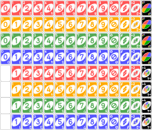

# The Game of UNO!

## The Deck

- There are 2 of each color-value combos for 1-9, skip, reverse, and draw 2.
- There are 4 0's (one of each color), 4 Wild Draw4's, and 4 Wild cards.

## The Rules
1. For each turn, a player can either discard or draw a card (if they have no valid cards to discard).
2. A player who draws from the deck must either play or keep that card and may play no other card from their hand on that turn.
3. A player may play a Wild card at any time, even if that player has other playable cards.
4. If the entire deck is used during play, the top discard is set aside and the rest of the pile is shuffled to create a new deck. Play then proceeds normally.

### Special Cards
- A skip card skips the next player's turn.
- A reverse card reverses the order of play. 
- A Wild card or Wild Draw 4 card allows the player to change the color in play.
- A Draw 2 card or Wild Draw 4 card makes the next player draw 2 or 4 cards respectively.
    - I also implemented a house rule called Progressive Uno: If a draw card is played, and the following player has the same card, they can play that card and "stack" the cards, which adds to the current amount of cards to draw and passes it to the following player.

### Valid Plays
- Play a card matching the discard in color or value.
- Play a Wild card or a Wild Draw 4 card. 
- Draw the top card of the deck.

## Design Choices
1. I limited the amount of players to 4 at all times so that I could generalize the logic for players and turns.
2. I implemented "computers" which can be anywhere from 1-3 depending on how many real players are playing. 
3. Every turn, a list of valid plays is compiled. For every card in the player's hand, if the card can be played when compared with the current card at the top of the discard pile, it is added to this list. For computers, a random index of this list if chosen and that card is played. For players, the game reprompts is the card chosen is not in the list of valid plays.
4. In each class, I keep track of certain instance attributes and methods in order to provide functionality throughout the game:

    ### The Player Class
    - name: a string representing the player's name to keep track of who is the current player..
    - cards: a list of cards in the player's deck.
    - is_computer: a boolean value to tell whether or not a play is a computer.
    - uno: a boolean value to tell whether or not a player currently only has 1 card. This is important, because a player could have an uno, but their last card could be an invalid play or the previous player could play a draw card. Thus, this would need to be able to be changed back in forth between True and False.
    - `__repr__()`: very simple method mostly for testing purposes. 

    ### The Card Class
    - value: An int 0-9 OR a string "plus4  ", "plus2  ", "skip   ", "reverse", "wild   "
    - color: A string "yellow ", "red    ", "green  ", "blue   ", "choose "
    - played: This is a boolean value for Draw 2 and Wild Draw 4 cards. It is used if the discard card is a Draw 2 or Draw 4 card to tell whether or not that card's penalty has already been drawn. 
    - `is_valid_play()`: Method to tell whether a card is a valid play. I almost put this inside the Game class, but due to the played attribute it made more sense to put it within this class.
    - `is_adder()`: Returns True if the card is a Draw 2 or Wild Draw 4 and False otherwise.

    ### The Game Class
    - players: List of Player objects. players[0] is the current player.
    - deck: Deck of cards using the deck() function and the pyCardDeck library. 
    - discard: The card on the top of the discard pile.
    - plus_cards: Keeps track of how many cards have added up as a result of Progressive Uno (see Special Cards)
    - discarded: Keeps track of past discarded cards so that you can make a new deck if the Game's deck runs out.
    - `deal_cards()`: Uses the pyCardDeck library to deal cards to each player.
    - `take_turn()`: Main logic for players to take a turn.
    - `effect()`: Called at the end of each turn to handle the effects of the cards played.
    - `shift_players()`: Shifts the players left, so that the next player is now the current player. If players = [1, 2, 3, 4], then after calling this method, players = [2, 3, 4, 1].
    - `uno_or_over()`: Logic for is a player has an uno or has won the game.

5. I also had 2 functions outside of the class. 
    - `deck()`: constructs a list of all the cards in an UNO deck. Is only used in the Game class's init method.
    - `play_game()`: initializes the game and takes care of how many computers to implement. 

6. External Libraries Used
    - `os`: clears the screen after a game ends and before each turn.
    - `time`: delays so that the players can read the messages printed to the screen.
    - `pyCardDeck`: handles shuffling and drawing cards.
    - `random`: used to bring randomness to the computers' plays.